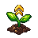

# Seed Priority

<p align="center">
  
</p>

Seed Priority is a small RuneLite plugin that makes farming interactions win when several targets occupy the same tile.

You have selected a seed, click the bird house beneath your character, and another player receives the `Use` action instead. Or a sapling loses to an unrelated target standing over a patch. Seed Priority fixes that friction by moving the relevant farming destination to the top of RuneLite's existing menu.

## What it prioritises

| Selected item | Preferred destination |
| --- | --- |
| Seeds | Bird houses and farming patches |
| Saplings, seedlings, compost, farming tools, and supplies | Farming patches |
| Items used on a compost bin | Compost bins |
| Items used on a Tool Leprechaun | Tool Leprechauns |

Bird houses have the highest priority, followed by compost bins, patches, and Tool Leprechauns. If more than one valid destination is under the cursor, the most specific farming interaction wins.

## What it does not do

Seed Priority does not click, send actions, add server interactions, or remove menu entries. It only reorders menu entries RuneLite and Old School RuneScape already provide. Player and unrelated-item options remain available in the right-click menu.

The plugin is deliberately limited to selected-item `Use` interactions. Normal left-click options, PvP attack options, Construction, and blackjacking are not changed.

## Why

Farming and bird house runs involve repeated item-on-object interactions in busy areas. Those interactions should be predictable even when players, pets, or dropped items overlap the intended target. The plugin removes that small but recurring source of misclicks while preserving every original choice.

## Building

Seed Priority targets Java 11 and follows the standard RuneLite external-plugin layout.

```text
./gradlew build
```

To launch a developer RuneLite client with the plugin loaded:

```text
./gradlew run
```

## Testing in game

1. Enable Seed Priority.
2. Select seeds and click a placed bird house while another player occupies the same tile.
3. Select a seed or sapling and click its patch through an overlapping player or ground item.
4. Use compostable produce on a compost bin through an overlapping target.
5. Confirm the non-farming targets are still present in the right-click menu.

## Author

Created by **IVIystical**.

## License

[BSD 2-Clause](LICENSE)
